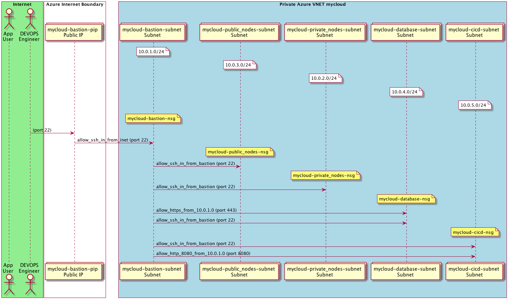

Terraform with Jsonnet for Azure VNets w/ Bastion
---------

An example of using terraform to call Azure APIs to provision a vnet with
subnets, network security groups,  and a bastion host.

# QUICK START

1. Create a service principal if you haven't already
    ```console
    az ad sp create-for-rbac -n "mycloud-1-sp" --role="Contributor"
    ```
1. Set env vars
    ```bash
    export ARM_SUBSCRIPTION_ID=
    export ARM_CLIENT_ID=
    export ARM_CLIENT_SECRET=
    export ARM_TENANT_ID=
    ```
1. Create `config.jsonnet` by copying and editing `config.bastion.example.jsonnet`
1. Generate Terraform JSON
    ```console
    ./build.sh
    ```
1. Deploy to Azure
    ```console
    ./deploy.sh
    ```

The above steps generate this network:



Above diagram created by [azuml](https://github.com/navicore/azuml).

# WHY

I recently had to add a lot of NSG rules to a Terraform HCL + Azure project.
The resulting HCL was verbose and riddled with rule name and rule priority
conflicts.

I realized I had to invest more of my time to learn HCL better to make the code
correct and maintainable or find a new way to express the rules.  I considered
three options: work smarter with HCL, write a code generator app that wrote HCL
from a config file - ie: create my own DSL, or try
[jsonnet](http://jsonnet.org/).  jsonnet met my needs and I can use it for
other purposes such as creating Kubernetes yaml.

The Terraform tool is still extremely valuable without HCL.  While I don't use
any HCL language features in this demo, I do use Terraform interpolation syntax
for resolving the "not known until deployment" attributes.

